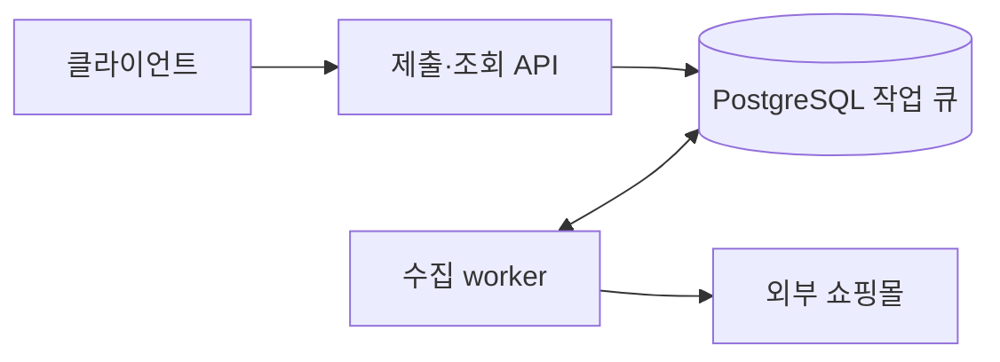

# 위굴 · Backend

구매를 고민하는 순간부터 구매 후 회고까지, 자신의 소비 기준을 만들어가는 서비스입니다.

쇼핑 링크로 관심 상품을 저장하고, 기회비용과 소비 기준을 점검한 뒤 구매 여부를 결정합니다. 구매 후에는 소비 내역과 회고를 통해 지난 선택을 돌아봅니다.

[서비스](#서비스) · [팀과 기여](#팀과-기여) · [주요 설계](#주요-설계) · [테스트와 운영](#테스트와-운영) · [로컬 실행](#로컬-실행)

## 서비스

| 사용자 흐름 | 백엔드 기능 |
| --- | --- |
| 가입과 소비 기준 설정 | 카카오·구글 로그인, 온보딩, 프로필·월 예산 관리 |
| 관심 상품 저장 | 링크에서 상품명·가격·이미지 수집, 위시리스트 저장·조회·수정 |
| 구매 판단 | 셀프체크·기회비용 확인, 구매 결정과 예산 반영 |
| 소비 돌아보기 | 홈 요약, 월별 소비 내역, 구매 7일 후 알림과 회고 |
| 의견 나누기 | 소셜 게시글·댓글·투표, 신고·차단 |

## 팀과 기여

백엔드 개발자 2명이 함께 개발했습니다.

| 개발자 | 주요 기여 |
| --- | --- |
| [박재홍 · PHJ2000](https://github.com/PHJ2000) | 애플리케이션·스키마 기반, 인증·온보딩·위시리스트·홈·구매 결정·기회비용 API 구현.<br>상품 수집·알림, 테스트·CI/CD·QA 환경 구축과 성능·보안·구조 개선. |
| [Jung Daeun · ekdmssld](https://github.com/ekdmssld) | 소셜 피드·마이페이지·월별 소비기록·신고 API 구현.<br>숙려 화면과 구매 결정 재시도 등 사용자 흐름 보완, 서비스·API 테스트. |

[영역별 구현 PR과 코드 리뷰 기여](./docs/TEAM_CONTRIBUTIONS.md)

## 주요 설계

Java 21 · Spring Boot 3.5.16 · Spring Data JPA / JDBC · PostgreSQL · Flyway · Playwright

### 비동기 상품 수집

외부 쇼핑몰 응답과 브라우저 렌더링을 기다리는 작업을 API 요청 처리에서 분리했습니다. 클라이언트는 제출 API에서 받은 작업 ID로 진행 상태와 최종 결과를 조회합니다.

별도 메시지 브로커 대신 기존 PostgreSQL에 작업을 저장합니다. 프로세스가 중단되어도 작업 상태가 남고, worker가 가져갈 작업과 실행량을 제어할 수 있습니다.



- 실행량 제어: `FOR UPDATE SKIP LOCKED`로 작업을 가져가고, 큐 용량과 사용자별 활성 작업 수를 제한합니다.
- 중복 수집 방지: 같은 상품은 대표 작업 하나만 수집합니다. 결과는 공유하되 사용자별 작업 ID·원본 URL·조회 권한은 분리합니다.
- 중단 작업 복구: 재시도 시 `attempt_count`로 작업 소유권을 확인해, 이전 worker의 늦은 완료가 새 결과를 덮어쓰지 못하게 합니다.

성공 결과는 기본 5분, 실패 결과는 30초 동안 재사용합니다. 외부 요청은 줄지만 캐시가 유지되는 동안 가격 변경이 늦게 반영될 수 있습니다. 필수 상품값을 확정할 수 없으면 추정값을 저장하지 않고 실패로 처리합니다.

[큐 설계와 대안](./docs/decisions/ADR-001-shopping-import-async-job-queue.md) · [병합·캐시 운영](./docs/SHOPPING_IMPORT_SHARED_CRAWL_OPERATIONS.md)

<details>
<summary>상품 정확도와 worker 병렬도 검증 기록</summary>

2026년 7월 14~15일 실사이트 검증에서는 9개 사이트의 표본 110건에서 상품명·원화 가격·대표 이미지가 원본과 일치했습니다. 접근이 막힌 스마트스토어는 성공 집계에서 제외했습니다. 이 결과는 당시 표본에 한정됩니다.

별도의 정적 HTML 부하 실험에서는 worker 3개로 100건 모두 60초 내 완료했지만, 100건 모두 하나 이상의 상품 필드가 불일치했고 Chromium 경로도 실행되지 않았습니다. 완료율만으로 병렬도를 늘리지 않고 기본값을 1로 유지했습니다.

[정확도 검증 기록](./docs/SHOPPING_IMPORT_ACCURACY_POLICY.md) · [부하 실험 조건과 결과](./docs/performance/NF-84-shopping-import-load-test-report.md) · [작업 큐 통합 테스트](./src/test/java/com/sagongsa/backend/itemimport/ShoppingImportJobApiIntegrationTest.java)

</details>

### 마이페이지 N+1 개선

목록을 만들면서 게시글별 투표를 조회하거나 연관 상품을 지연 로딩하던 경로를 개선했습니다.

| 20건 목록 조회 | 기존 SQL | 개선 후 SQL |
| --- | ---: | ---: |
| 내 게시글 | 24회 | 5회 |
| 내가 투표한 게시글 | 44회 | 4회 |

내 투표는 페이지 단위로 일괄 조회하고, 투표 목록의 게시글·작성자·상품은 fetch join으로 함께 가져옵니다. 사용자별 활성 투표의 최신순 조회에는 부분 인덱스를 추가했습니다. 기존 커서 페이징과 차단 사용자 필터는 유지했습니다.

수치는 PostgreSQL 통합 테스트의 Hibernate prepared statement 기준입니다. [전후 측정 기록](https://github.com/SaGongSa-404/404_BE/pull/246)과 [쿼리 수 회귀 테스트](./src/test/java/com/sagongsa/backend/mypage/MypageQueryCountIntegrationTest.java)에서 조건을 확인할 수 있습니다.

### 구매 결정과 예산 정합성

구매 기록만 저장되고 예산이 반영되지 않는 상황을 막기 위해, 결정 저장·예산 변경·리마인더 예약을 한 트랜잭션으로 처리합니다. 결정을 수정할 때는 이전 금액과의 차이만 예산에 반영합니다.

[구매 결정 처리 코드](./src/main/java/com/sagongsa/backend/decision/DecisionCommands.java) · [API 통합 테스트](./src/test/java/com/sagongsa/backend/decision/DecisionApiIntegrationTest.java)

## 테스트와 운영

### 회귀 테스트

- 입력·응답 계약은 서비스·컨트롤러 테스트로, DB 제약·잠금·쿼리 수·작업 복구는 Testcontainers의 PostgreSQL로 검증합니다.
- 일반 상품 수집 테스트는 fake `PageFetcher`를 사용합니다. 외부 사이트의 상품값 검증은 별도로 실행해 사이트 장애가 일반 CI에 영향을 주지 않게 했습니다.
- `develop` 대상 PR과 push에서 [테스트·JaCoCo 보고서 생성](./.github/workflows/ci.yml)을 실행합니다. 앱 QA에는 예산·결정·회고·피드 상태를 재현하는 [시나리오 데이터](./docs/issues/NF-63-qa-scenario-pack.md)를 제공합니다.

### QA 배포와 장애 추적

단일 VM에서 Caddy와 standby 프로세스를 사용하는 배포 절차를 구성했습니다.

1. 새 JAR를 8081에서 기동하고 health를 확인한 뒤 트래픽을 전환합니다.
2. 기존 8080을 새 JAR로 재시작하고 health를 확인합니다.
3. 트래픽을 8080으로 돌린 뒤 standby를 종료합니다.

8080 복구가 실패하면 트래픽을 standby에 유지합니다. 두 프로세스가 동시에 실행되는 동안의 메모리 여유와 DB 마이그레이션의 구버전 호환성이 필요합니다.

응답의 `X-Request-Id`로 앱 요청과 서버 로그를 연결하고, 로그 검색·수동 재시작 절차도 문서화했습니다.

[배포 workflow](./.github/workflows/deploy-qa.yml) · [CBT 장애 대응](./docs/CBT_SERVER_RESPONSE_RUNBOOK.md)

### 푸시 알림

구매 7일 후 리마인더를 DB 알림과 FCM에 연결했습니다. 푸시 수신 설정과 기기 토큰의 유효성을 확인하고, 외부 FCM 전송은 DB 트랜잭션 밖에서 실행합니다. FCM의 영속 재시도·Outbox는 아직 구현하지 않았습니다.

[FCM 운영](./docs/FCM_PUSH_OPERATIONS.md) · [트랜잭션 분리와 검증](./docs/BACKEND_REFACTOR_RESULT_2026-09-07.md)

### 운영 접근 제한

운영 환경에서는 QA용 토큰 발급을 기본 비활성화하고 개발·테스트 페이지 접근을 차단했습니다. API·인증 요청 제한과 소셜 이미지 URL 검증도 적용했습니다.

[운영 접근·이미지 URL 보호](https://github.com/SaGongSa-404/404_BE/pull/257)

## 로컬 실행

Git과 실행 중인 Docker Engine, Docker Compose v2가 필요합니다.

```bash
git clone https://github.com/SaGongSa-404/404_BE.git
cd 404_BE
docker compose up --build
```

[상태 확인](http://localhost:8080/health)에서 HTTP 200과 `status: UP`을 확인합니다. 소셜 로그인·FCM은 별도 자격증명 설정이 필요합니다.

테스트는 JDK 21과 Docker Engine을 준비한 뒤 실행합니다.

```bash
./gradlew test jacocoTestReport
```

PowerShell: `.\gradlew.bat test jacocoTestReport`

커버리지 보고서: `build/reports/jacoco/test/html/index.html`

[환경변수·상세 실행 안내](./docs/LOCAL_DEVELOPMENT.md) · [API 회귀 테스트 범위](./docs/prs/NF-38-SERVICE_API_REGRESSION_TEST_SCOPE.md) · [부하 테스트 재현](./load-tests/shopping-import/README.md)

## 더 알아보기

[도메인·스키마](./docs/DOMAIN_SCHEMA_REVISED_FROM_PLANNING_2026_04_16.md) · [소셜 로그인 설정](./docs/SOCIAL_LOGIN_SETUP_AND_POLICY.md) · [브라우저 수집 운영](./docs/SHOPPING_BROWSER_FETCHER_OPERATIONS.md)
