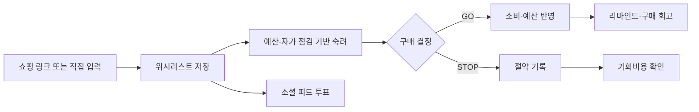
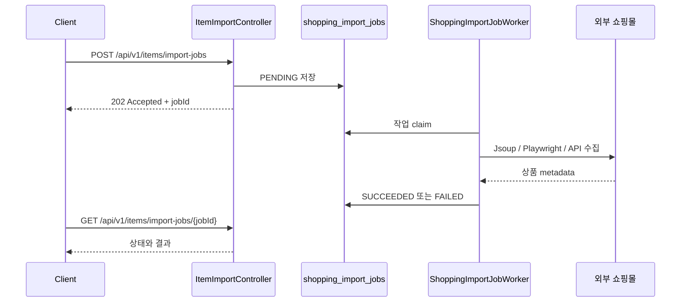
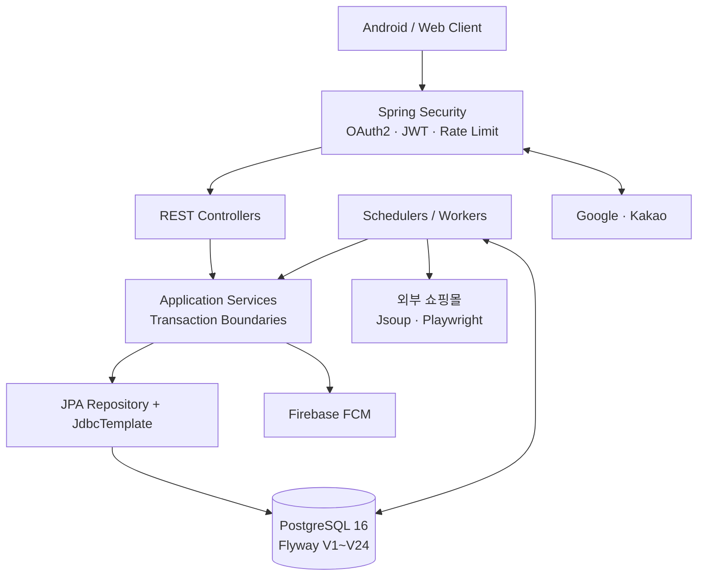

# 위굴(Wigul) Backend

> 사고 싶은 순간을 저장하고, 충분히 고민하고, 결정한 뒤 돌아보게 돕는 소비 의사결정 서비스

[](https://github.com/SaGongSa-404/404_BE/actions/workflows/ci.yml)
[](https://openjdk.org/projects/jdk/21/)
[](https://spring.io/projects/spring-boot)
[](https://www.postgresql.org/)

위굴 Backend는 쇼핑 링크나 직접 입력으로 갖고 싶은 물건을 모으고, 월 예산과 자기 점검을 바탕으로 구매 여부를 결정하며, 리마인드·회고·소셜 투표까지 이어 주는 Spring Boot API입니다.

초기 도메인·스키마 검증 단계에서 출발해 현재는 OAuth/JWT 인증, 위시리스트, 숙려와 구매 결정, 소셜 피드, 알림, 외부 쇼핑몰 상품 수집, PostgreSQL 기반 비동기 작업 큐, 운영 보안과 QA 배포 자동화까지 갖춘 백엔드로 발전했습니다.

## 서비스 흐름



1. 사용자는 Google/Kakao로 로그인하고 닉네임·월 예산·마스코트를 설정합니다.
2. 쇼핑 링크를 가져오거나 상품을 직접 입력해 위시리스트에 저장합니다.
3. 자기 점검 질문과 예산 영향을 확인한 뒤 `GO` 또는 `STOP`을 결정합니다.
4. 결정 결과는 소비 통계·예산·마스코트 상태·리마인드에 함께 반영됩니다.
5. 구매 후 회고를 남기거나 소셜 피드에서 다른 사용자의 의견을 받을 수 있습니다.

## 주요 기능

| 영역 | 제공 기능 |
| --- | --- |
| 인증·온보딩 | Google/Kakao OAuth2 로그인, JWT access/refresh token, refresh token 교체·폐기, 약관 동의, 닉네임·월 예산·마스코트 설정 |
| 위시리스트 | 상품 직접 저장, 링크 기반 미리보기, 조회·수정·삭제, 카테고리 수정, 저장 요청 멱등성, 가격 기반 기회비용 추천 |
| 쇼핑 링크 수집 | URL 검증·정규화, Jsoup 정적 수집, Playwright 동적 렌더링 보완, 쇼핑몰별 metadata/API fallback, 상품명·가격·이미지·카테고리 추출 |
| 숙려·구매 결정 | 상품별 자기 점검, `GO`/`STOP` 결정, 중복 요청 멱등 처리, 결정 수정 이력, 월 예산 자동 승계·소비 반영 |
| 홈·마이페이지 | 예산 현황, 결정 요약, 말풍선 상태, 월별 소비 통계, 위시 히스토리, 작성 글·투표 내역 |
| 소셜·회고 | 게시글·댓글·투표, 이미지 업로드, 익명 닉네임 정책, 신고·차단, 관리자 제재, 구매 회고 |
| 알림 | 인앱 알림, 전체 읽음, 기기 push token, 알림 설정, 7일 리마인드, 조건 기반 알림, FCM 발송, 관리자 공지 |
| 운영·보안 | API/auth/고비용 요청 rate limit, production 설정 guard, 외부 이미지 URL 검증, 비공개 개발 화면 차단, health·Prometheus metrics |

## 핵심 엔지니어링

### PostgreSQL 작업 큐로 외부 수집 격리

쇼핑몰 응답 지연과 브라우저 렌더링 비용이 API 요청 스레드와 서버 안정성에 직접 번지지 않도록 `shopping_import_jobs`가 작업 상태를 소유합니다.



- `PENDING → RUNNING → SUCCEEDED/FAILED` 상태 전이를 DB에 기록합니다.
- 사용자별 활성 작업 수와 전체 큐 크기를 제한하고, worker concurrency를 설정으로 조절합니다.
- 중단된 `RUNNING` 작업을 복구하고 완료 결과는 보관기간 뒤 정리합니다.
- 동일 URL의 진행 중 요청을 합치고 짧은 성공/실패 cache를 재사용해 중복 외부 호출을 줄입니다.
- 기존 동기 API도 내부적으로 같은 큐에 제출한 뒤 제한 시간 동안 결과를 기다려 수집 책임을 한 경로로 모았습니다.

자세한 설계는 [ADR-001](docs/decisions/ADR-001-shopping-import-async-job-queue.md), [공유 수집 운영 가이드](docs/SHOPPING_IMPORT_SHARED_CRAWL_OPERATIONS.md), [정확성 정책](docs/SHOPPING_IMPORT_ACCURACY_POLICY.md)을 참고하세요.

### 트랜잭션으로 연결한 구매 결정

구매 결정은 단일 결과 행만 저장하는 작업이 아닙니다. `DecisionService`가 결정 결과, 위시 상태, 자기 점검, 월 예산, 마스코트 상태와 리마인더를 하나의 트랜잭션 경계에서 조정합니다. 중복 완료 요청은 기존 결과를 반환하며, 결정 수정 시에는 예산 차액과 변경 이력도 함께 반영합니다.

### 실패를 전제로 한 알림

알림은 먼저 `notifications`에 중복 방지 키와 함께 저장하고, 트랜잭션 커밋 뒤 FCM 전송을 시도합니다. 외부 전송이 실패해도 인앱 알림 기록은 유지하며, 유효하지 않은 기기 토큰은 비활성화합니다.

### 운영 경계와 자동화

- 외부 요청은 인증 전 `ApiRateLimitFilter`를 거치며 일반 API, 인증, 고비용 요청, health 정책을 구분합니다.
- production profile은 개발용 인증 경로와 Swagger를 비활성화하고 loopback bind를 기본값으로 사용하며, 약한 secret과 위험한 쇼핑 수집 설정은 시작 단계에서 차단합니다.
- CI는 `develop` 대상 PR과 push에서 Java 21 테스트와 JaCoCo 리포트를 생성합니다.
- QA CD는 candidate JAR을 `8081` standby로 기동해 health를 확인한 뒤 교체하고, 실패 시 기존 경로를 보존하도록 구성되어 있습니다.

## 아키텍처



이 저장소는 기능 단위 패키지 안에서 Controller-Service-Persistence 흐름을 사용합니다. 일반 도메인 상태는 JPA entity/repository가 다루고, 작업 claim·복구·집계처럼 SQL 의미가 중요한 경로는 `JdbcTemplate`을 함께 사용합니다. PostgreSQL과 Flyway migration이 영속 상태 계약의 기준입니다.

### 디렉터리 구조

```text
src/main/java/com/sagongsa/backend/
├── auth/           # OAuth2, JWT, refresh token, 현재 사용자
├── onboarding/     # 초기 설문·프로필·예산 설정
├── wishlist/       # 위시 상품과 기회비용
├── itemimport/     # 쇼핑 링크 수집, 동기 bridge, DB 작업 큐
├── deliberation/   # 숙려 질문 조회
├── decision/       # GO/STOP 결정과 예산·상태 반영
├── reflection/     # 구매 후 회고
├── social/         # 게시글·댓글·투표·신고·차단
├── notification/   # 인앱 알림, FCM, scheduler/worker
├── mypage/         # 프로필·소비 통계·활동 이력
├── security/       # 요청 제한과 production 보안 경계
├── observability/  # request context와 metric
└── domain/         # JPA entity, enum, repository

src/main/resources/
├── db/migration/   # Flyway V1~V24
├── application.yml
└── application-prod.yml
```

더 깊은 실행 흐름·상태 소유권·위험·디버깅 경로는 인터랙티브 문서 [docs/understanding.html](docs/understanding.html)에서 확인할 수 있습니다.

## 기술 스택

| 분류 | 기술 |
| --- | --- |
| Language | Java 21 |
| Framework | Spring Boot 3.5.16, Spring MVC, Spring Security, OAuth2 Client/Resource Server, Validation |
| Data | Spring Data JPA, JdbcTemplate, PostgreSQL 16, Flyway |
| External | Firebase Admin SDK 9.9.0, Jsoup 1.18.3, Playwright 1.59.0 |
| API | springdoc-openapi / Swagger UI |
| Observability | Spring Boot Actuator, Micrometer, Prometheus, structured request context log |
| Test | JUnit 5, Spring Boot Test, Spring Security Test, Testcontainers, JaCoCo |
| Build·Deploy | Gradle Wrapper, Docker, Docker Compose, GitHub Actions, GCP VM, Caddy, systemd |

## 로컬 실행

### 준비물

- JDK 21
- Docker Engine 또는 Docker Desktop

### 1. Docker Compose로 애플리케이션과 DB 실행

```bash
docker compose up --build
```

- API: `http://localhost:8080`
- PostgreSQL: `localhost:5432` (`404_be` / `postgres` / `postgres`)
- Swagger UI: `http://localhost:8080/swagger-ui/index.html`
- Health: `http://localhost:8080/health`

> 현재 `Dockerfile`에는 Chromium 설치 단계가 없습니다. 일반 API와 Jsoup 수집은 실행할 수 있지만 Playwright browser fallback까지 필요한 환경은 [쇼핑 브라우저 수집 운영 가이드](docs/SHOPPING_BROWSER_FETCHER_OPERATIONS.md)에 따라 브라우저 실행 의존성을 별도로 준비해야 합니다.

### 2. PostgreSQL만 Docker로 실행하고 Gradle로 애플리케이션 실행

```bash
docker compose up -d postgres

SPRING_DATASOURCE_PASSWORD=postgres \
APP_JWT_SECRET=local-development-jwt-secret-change-me \
./gradlew bootRun
```

로컬 기본 profile에서는 Swagger가 활성화됩니다. 실제 Google/Kakao 로그인을 확인하려면 각 OAuth client 정보와 redirect URI를 추가로 설정해야 합니다.

### 3. 테스트와 커버리지

```bash
./gradlew test jacocoTestReport
```

통합 테스트는 Testcontainers의 `postgres:16-alpine`을 사용하므로 별도 로컬 PostgreSQL은 필요하지 않지만 Docker Engine은 실행 중이어야 합니다.

- HTML coverage: `build/reports/jacoco/test/html/index.html`
- XML coverage: `build/reports/jacoco/test/jacocoTestReport.xml`

## 주요 환경변수

아래는 로컬 실행과 운영 경계를 이해하는 데 필요한 대표 항목입니다. 전체 기본값은 [`application.yml`](src/main/resources/application.yml), production override는 [`application-prod.yml`](src/main/resources/application-prod.yml)을 기준으로 확인하세요.

| 변수 | 로컬 기본값 | 설명 |
| --- | --- | --- |
| `SPRING_DATASOURCE_URL` | `jdbc:postgresql://localhost:5432/404_be` | PostgreSQL JDBC URL |
| `SPRING_DATASOURCE_USERNAME` | `postgres` | DB 사용자 |
| `SPRING_DATASOURCE_PASSWORD` | empty | DB 비밀번호 |
| `APP_JWT_SECRET` | local development value | JWT 서명 키. production에서는 강한 외부 secret이 필수입니다. |
| `GOOGLE_CLIENT_ID`, `GOOGLE_CLIENT_SECRET` | placeholder | Google OAuth client |
| `KAKAO_CLIENT_ID`, `KAKAO_CLIENT_SECRET` | placeholder | Kakao OAuth client |
| `APP_ALLOWED_REDIRECT_URI_PREFIXES` | local/app scheme 목록 | 로그인 완료 redirect 허용 경계 |
| `APP_UPLOAD_DIR` | `./uploads` | 소셜 이미지 저장 위치 |
| `APP_PUSH_FCM_ENABLED` | `false` | 실제 FCM sender 활성화 |
| `APP_PUSH_FCM_CREDENTIALS_LOCATION` | empty | 저장소 밖 Firebase service account 위치 |
| `APP_ADMIN_NOTIFICATION_TOKEN` | empty | 관리자 알림 API의 `X-Admin-Token` 검증 값 |
| `SHOPPING_IMPORT_BROWSER_FETCH_ENABLED` | `true` | Playwright browser fallback 활성화 |
| `SHOPPING_IMPORT_JOB_MAX_QUEUE_SIZE` | `100` | 전체 `PENDING`/`RUNNING` 작업 상한 |
| `SHOPPING_IMPORT_JOB_MAX_ACTIVE_PER_USER` | `1` | 사용자별 활성 작업 상한 |
| `SHOPPING_IMPORT_JOB_CONCURRENCY` | `1` | 기본 worker 동시 실행 수 |
| `SHOPPING_IMPORT_JOB_MAX_ATTEMPTS` | `2` | 중단 작업의 최대 claim 횟수 |
| `MANAGEMENT_SERVER_ADDRESS` | `127.0.0.1` | Actuator management bind 주소 |
| `MANAGEMENT_SERVER_PORT` | `9090` | Actuator management 포트 |

민감한 값은 커밋하지 말고 환경변수나 서버 외부 secret 파일로 주입하세요. FCM 설정과 검증 순서는 [FCM 운영 가이드](docs/FCM_PUSH_OPERATIONS.md)를 따릅니다.

## API 확인

- Swagger UI: `GET /swagger-ui/index.html` (로컬 profile)
- OpenAPI JSON: `GET /v3/api-docs` (로컬 profile)
- 애플리케이션 health: `GET /health`, `GET /api/health`
- management health: `GET http://127.0.0.1:9090/actuator/health`
- Prometheus: `GET http://127.0.0.1:9090/actuator/prometheus`

production profile에서는 Swagger/OpenAPI가 비활성화되고 management server는 기본적으로 loopback에만 노출됩니다.

## 문서

| 문서 | 내용 |
| --- | --- |
| [시스템 이해 지도](docs/understanding.html) | 아키텍처, 실행 흐름, 데이터 여정, 상태 소유권, 위험, 디버깅과 확장 지점 |
| [도메인·스키마 기준](docs/DOMAIN_SCHEMA_REVISED_FROM_PLANNING_2026_04_16.md) | 핵심 도메인과 PostgreSQL 스키마 결정 배경 |
| [쇼핑 import 비동기 큐 ADR](docs/decisions/ADR-001-shopping-import-async-job-queue.md) | DB 작업 큐 선택과 트랜잭션 경계 |
| [쇼핑 수집 정확성 정책](docs/SHOPPING_IMPORT_ACCURACY_POLICY.md) | 상품명·가격·이미지 판정과 실패 정책 |
| [공유 수집 운영 가이드](docs/SHOPPING_IMPORT_SHARED_CRAWL_OPERATIONS.md) | 동일 URL 병합, cache, metrics 운영 |
| [브라우저 수집 운영 가이드](docs/SHOPPING_BROWSER_FETCHER_OPERATIONS.md) | Playwright/Chromium 설정과 장애 대응 |
| [소셜 로그인 설정](docs/SOCIAL_LOGIN_SETUP_AND_POLICY.md) | Google/Kakao OAuth 설정과 redirect 정책 |
| [FCM 운영 가이드](docs/FCM_PUSH_OPERATIONS.md) | service account, 환경변수, 발송 검증 |
| [쇼핑 import 부하 테스트](docs/performance/NF-84-shopping-import-load-test-report.md) | 비동기 전환 전후 재현 가능한 부하 측정 |
| [CBT 서버 대응 런북](docs/CBT_SERVER_RESPONSE_RUNBOOK.md) | CBT 운영 점검과 장애 대응 순서 |

## 함께 만든 사람

위굴 Backend는 두 기여자가 초기 스키마 기준선부터 사용자 기능, 테스트, 외부 연동, 운영 안정화까지 함께 확장해 온 프로젝트입니다. 아래 내용은 `develop`에 반영된 Git commit과 merged PR을 기준으로 정리했습니다.

| 기여자 | 주요 기여 |
| --- | --- |
| **박재홍 [@PHJ2000](https://github.com/PHJ2000)** | **Backend · Infra** — MVP 도메인/스키마와 OAuth/JWT 인증, 위시리스트·구매 결정·홈·알림 API를 구축했습니다. 쇼핑 링크 수집을 정적 parsing에서 Playwright 렌더링, PostgreSQL 비동기 큐, 요청 병합·단기 cache·metrics, worker 동시성 제어로 발전시켰습니다. FCM, GitHub Actions CI/CD, QA standby 배포, 성능 측정, rate limit과 production 보안 경계도 담당했습니다. |
| **정다은 [@ekdmssld](https://github.com/ekdmssld)** | **Backend** — 소셜 피드의 게시글·댓글·투표, 익명 닉네임 정책과 신고 기능을 구현했습니다. 마이페이지·월별 소비 기록, 숙려 자가 점검, 예산 소진 UX 상태를 확장했고 구매 결정 멱등성, 온보딩 닉네임 저장 등 사용자 흐름의 정합성을 보완했습니다. 주요 Service/Controller 통합 테스트를 작성해 회귀 검증 기반을 넓혔습니다. |

### 대표 작업

- 박재홍: [MVP 도메인/스키마 #6](https://github.com/SaGongSa-404/404_BE/pull/6), [Playwright 상품 수집 #55](https://github.com/SaGongSa-404/404_BE/pull/55), [CI #90](https://github.com/SaGongSa-404/404_BE/pull/90), [QA CD #145](https://github.com/SaGongSa-404/404_BE/pull/145), [PostgreSQL 비동기 큐 #191](https://github.com/SaGongSa-404/404_BE/pull/191), [요청 병합·cache·metrics #224](https://github.com/SaGongSa-404/404_BE/pull/224), [API rate limit #253](https://github.com/SaGongSa-404/404_BE/pull/253)
- 정다은: [소셜 피드 API #33](https://github.com/SaGongSa-404/404_BE/pull/33), [마이페이지 API #39](https://github.com/SaGongSa-404/404_BE/pull/39), [익명 닉네임 정책 #58](https://github.com/SaGongSa-404/404_BE/pull/58), [월별 소비 기록 #60](https://github.com/SaGongSa-404/404_BE/pull/60), [구매 결정 멱등성 #88](https://github.com/SaGongSa-404/404_BE/pull/88), [소셜 피드 통합 테스트 #103](https://github.com/SaGongSa-404/404_BE/pull/103), [구조화된 신고 #109](https://github.com/SaGongSa-404/404_BE/pull/109)

전체 변경 과정은 [Pull requests](https://github.com/SaGongSa-404/404_BE/pulls?q=is%3Apr+is%3Amerged)와 [Contributors](https://github.com/SaGongSa-404/404_BE/graphs/contributors)에서 확인할 수 있습니다.

## 기여 방법

1. 작업 내용을 GitHub Issue로 먼저 정의합니다.
2. `develop`에서 작업 종류와 tracking key를 포함한 브랜치를 만듭니다. 예: `feat/NF-117-short-description`, `docs/NF-117-short-description`
3. 저장소의 Issue/PR template에 맞춰 목적, 범위, 완료 조건과 검증 결과를 기록합니다.
4. 변경 종류에 맞는 테스트를 실행하고 Draft PR에서 구현 방향과 근거를 먼저 공유합니다.
5. 리뷰와 CI가 끝나면 `develop`에 반영합니다.

문서 변경도 실제 코드·설정·테스트를 근거로 작성하며, 런타임 동작을 바꾸는 작업은 관련 운영 문서와 [시스템 이해 지도](docs/understanding.html)를 함께 최신화합니다.
