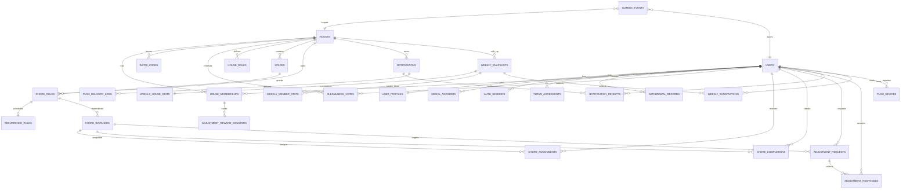

# 404 Backend ERD Draft

## 목적

이 문서는 모듈러 모놀리스 기준의 백엔드 데이터 모델 초안이다.

- 배포 단위: `api`, `worker`
- 저장소: `1 repo / 2 deployables / 1 PostgreSQL / 1 Redis`
- 설계 원칙: 화면은 facade가 조합하고, 데이터와 규칙은 도메인 모듈이 소유한다.

## 공통 규칙

- 모든 테이블은 `id`, `created_at`, `updated_at`를 가진다.
- 사용자 노출용 식별자가 필요하면 `public_id`를 별도로 둔다.
- FK는 PostgreSQL 기준 `uuid`를 기본으로 가정한다.
- soft delete가 필요한 경우 `deleted_at`을 사용한다.
- cross-module side effect는 direct write 대신 `outbox_events`를 통해 전달한다.

## 모듈별 소유 테이블

| Module | Tables |
| --- | --- |
| auth | `social_accounts`, `auth_sessions`, `terms_agreements` |
| user | `users`, `user_profiles`, `withdrawal_records` |
| house | `houses`, `house_memberships`, `invite_codes`, `house_roles`, `cleanliness_votes` |
| space | `spaces` |
| chore | `chore_rules`, `recurrence_rules`, `chore_instances`, `chore_assignments`, `chore_completions` |
| adjustment | `adjustment_requests`, `adjustment_responses`, `adjustment_reward_counters` |
| notification | `notifications`, `notification_receipts`, `push_devices`, `push_delivery_logs` |
| review | `weekly_snapshots`, `weekly_house_stats`, `weekly_member_stats`, `weekly_satisfactions` |
| shared | `outbox_events`, `idempotency_keys` |

## 핵심 관계

## 엔티티 상세

### auth

#### `social_accounts`

| Column | Type | Notes |
| --- | --- | --- |
| `id` | uuid | PK |
| `user_id` | uuid | FK -> `users.id` |
| `provider` | varchar(20) | `KAKAO` |
| `provider_user_id` | varchar(100) | provider 고유 식별자 |
| `email` | varchar(255) | nullable |
| `connected_at` | timestamptz | 연동 시각 |
| `last_login_at` | timestamptz | 최근 로그인 |

#### `auth_sessions`

| Column | Type | Notes |
| --- | --- | --- |
| `id` | uuid | PK |
| `user_id` | uuid | FK |
| `refresh_token_hash` | varchar(255) | 원문 저장 금지 |
| `device_id` | varchar(100) | nullable |
| `device_name` | varchar(100) | nullable |
| `status` | varchar(20) | `ACTIVE`, `REVOKED`, `EXPIRED` |
| `expires_at` | timestamptz | 만료 시각 |
| `revoked_at` | timestamptz | nullable |

#### `terms_agreements`

| Column | Type | Notes |
| --- | --- | --- |
| `id` | uuid | PK |
| `user_id` | uuid | FK |
| `terms_type` | varchar(30) | `SERVICE`, `PRIVACY`, `MARKETING` |
| `terms_version` | varchar(20) | 동의 버전 |
| `is_required` | boolean | 필수 여부 |
| `agreed_at` | timestamptz | 동의 시각 |

### user

#### `users`

| Column | Type | Notes |
| --- | --- | --- |
| `id` | uuid | PK |
| `status` | varchar(20) | `ACTIVE`, `WITHDRAWN` |
| `primary_email` | varchar(255) | nullable |
| `last_login_at` | timestamptz | 최근 접속 |

#### `user_profiles`

| Column | Type | Notes |
| --- | --- | --- |
| `id` | uuid | PK |
| `user_id` | uuid | unique FK |
| `nickname` | varchar(40) | 집 내 공통 노출명 |
| `profile_image_url` | text | nullable |
| `timezone` | varchar(40) | 기본 `Asia/Seoul` |

#### `withdrawal_records`

| Column | Type | Notes |
| --- | --- | --- |
| `id` | uuid | PK |
| `user_id` | uuid | FK |
| `reason` | varchar(100) | nullable |
| `detail` | text | nullable |
| `withdrawn_at` | timestamptz | 탈퇴 시각 |

### house

#### `houses`

| Column | Type | Notes |
| --- | --- | --- |
| `id` | uuid | PK |
| `owner_membership_id` | uuid | FK -> `house_memberships.id` |
| `name` | varchar(80) | 집 이름 |
| `cleanliness_level` | varchar(20) | 합의된 기준 |
| `status` | varchar(20) | `ACTIVE`, `ARCHIVED` |

#### `house_memberships`

| Column | Type | Notes |
| --- | --- | --- |
| `id` | uuid | PK |
| `house_id` | uuid | FK |
| `user_id` | uuid | FK |
| `role` | varchar(20) | `OWNER`, `MEMBER` |
| `status` | varchar(20) | `ACTIVE`, `LEFT`, `REMOVED` |
| `joined_at` | timestamptz | 참여 시각 |
| `left_at` | timestamptz | nullable |

#### `invite_codes`

| Column | Type | Notes |
| --- | --- | --- |
| `id` | uuid | PK |
| `house_id` | uuid | FK |
| `code` | varchar(20) | unique |
| `status` | varchar(20) | `ACTIVE`, `USED`, `EXPIRED` |
| `expires_at` | timestamptz | nullable |
| `created_by_user_id` | uuid | FK |

#### `house_roles`

| Column | Type | Notes |
| --- | --- | --- |
| `id` | uuid | PK |
| `house_id` | uuid | FK |
| `role_name` | varchar(30) | 향후 확장용 |
| `permissions_json` | jsonb | 권한 세트 |

#### `cleanliness_votes`

| Column | Type | Notes |
| --- | --- | --- |
| `id` | uuid | PK |
| `house_id` | uuid | FK |
| `user_id` | uuid | FK |
| `vote_level` | varchar(20) | `LIGHT`, `BALANCED`, `THOROUGH` |
| `voted_at` | timestamptz | 투표 시각 |

### space

#### `spaces`

| Column | Type | Notes |
| --- | --- | --- |
| `id` | uuid | PK |
| `house_id` | uuid | FK |
| `name` | varchar(40) | 공간명 |
| `sort_order` | integer | 화면 노출 순서 |
| `status` | varchar(20) | `ACTIVE`, `ARCHIVED` |

### chore

#### `chore_rules`

| Column | Type | Notes |
| --- | --- | --- |
| `id` | uuid | PK |
| `house_id` | uuid | FK |
| `space_id` | uuid | FK |
| `title` | varchar(80) | 집안일 이름 |
| `description` | text | nullable |
| `default_assignee_membership_id` | uuid | FK nullable |
| `estimated_minutes` | integer | nullable |
| `status` | varchar(20) | `ACTIVE`, `ARCHIVED` |

#### `recurrence_rules`

| Column | Type | Notes |
| --- | --- | --- |
| `id` | uuid | PK |
| `chore_rule_id` | uuid | unique FK |
| `frequency` | varchar(20) | `DAILY`, `WEEKLY`, `CUSTOM` |
| `interval_value` | integer | 반복 주기 |
| `days_of_week` | varchar(20)[] | nullable |
| `start_date` | date | 시작일 |
| `end_date` | date | nullable |

#### `chore_instances`

| Column | Type | Notes |
| --- | --- | --- |
| `id` | uuid | PK |
| `house_id` | uuid | FK |
| `chore_rule_id` | uuid | FK |
| `scheduled_date` | date | 수행 예정일 |
| `status` | varchar(20) | `PENDING`, `COMPLETED`, `SKIPPED`, `RESCHEDULED` |
| `current_assignee_membership_id` | uuid | FK nullable |
| `origin_type` | varchar(20) | `RULE`, `MANUAL`, `ADJUSTED` |

#### `chore_assignments`

| Column | Type | Notes |
| --- | --- | --- |
| `id` | uuid | PK |
| `chore_instance_id` | uuid | FK |
| `assignee_membership_id` | uuid | FK |
| `assigned_by_user_id` | uuid | FK |
| `assigned_at` | timestamptz | 배정 시각 |
| `assignment_type` | varchar(20) | `AUTO`, `MANUAL`, `SUBSTITUTE` |

#### `chore_completions`

| Column | Type | Notes |
| --- | --- | --- |
| `id` | uuid | PK |
| `chore_instance_id` | uuid | FK |
| `completed_by_user_id` | uuid | FK |
| `completed_at` | timestamptz | 완료 시각 |
| `memo` | text | nullable |
| `proof_image_url` | text | nullable |

### adjustment

#### `adjustment_requests`

| Column | Type | Notes |
| --- | --- | --- |
| `id` | uuid | PK |
| `house_id` | uuid | FK |
| `chore_instance_id` | uuid | FK |
| `requester_membership_id` | uuid | FK |
| `request_type` | varchar(20) | `SUBSTITUTE`, `RESCHEDULE` |
| `reason` | text | nullable |
| `requested_date` | date | nullable, 일정 조정용 |
| `status` | varchar(20) | `OPEN`, `ACCEPTED`, `REJECTED`, `CANCELLED`, `EXPIRED` |
| `expires_at` | timestamptz | nullable |

#### `adjustment_responses`

| Column | Type | Notes |
| --- | --- | --- |
| `id` | uuid | PK |
| `adjustment_request_id` | uuid | FK |
| `responder_membership_id` | uuid | FK |
| `decision` | varchar(20) | `ACCEPT`, `REJECT` |
| `responded_at` | timestamptz | 응답 시각 |

#### `adjustment_reward_counters`

| Column | Type | Notes |
| --- | --- | --- |
| `id` | uuid | PK |
| `membership_id` | uuid | FK |
| `accepted_substitute_count` | integer | 기본값 0 |
| `last_settled_at` | timestamptz | nullable |

### notification

#### `notifications`

| Column | Type | Notes |
| --- | --- | --- |
| `id` | uuid | PK |
| `house_id` | uuid | FK |
| `actor_user_id` | uuid | FK nullable |
| `type` | varchar(30) | `CHORE_REMINDER`, `ADJUSTMENT_REQUEST`, `ADJUSTMENT_RESULT`, `WEEKLY_RECAP`, `SYSTEM` |
| `title` | varchar(120) | 표시 제목 |
| `body` | text | 표시 본문 |
| `payload_json` | jsonb | 딥링크용 payload |
| `occurred_at` | timestamptz | 이벤트 발생 시각 |

#### `notification_receipts`

| Column | Type | Notes |
| --- | --- | --- |
| `id` | uuid | PK |
| `notification_id` | uuid | FK |
| `user_id` | uuid | FK |
| `read_at` | timestamptz | nullable |
| `hidden_at` | timestamptz | nullable |

#### `push_devices`

| Column | Type | Notes |
| --- | --- | --- |
| `id` | uuid | PK |
| `user_id` | uuid | FK |
| `platform` | varchar(20) | `IOS`, `ANDROID` |
| `push_token` | varchar(255) | unique |
| `status` | varchar(20) | `ACTIVE`, `INACTIVE` |
| `last_seen_at` | timestamptz | 최근 갱신 |

#### `push_delivery_logs`

| Column | Type | Notes |
| --- | --- | --- |
| `id` | uuid | PK |
| `notification_id` | uuid | FK |
| `push_device_id` | uuid | FK |
| `provider` | varchar(20) | `FCM`, `APNS` |
| `status` | varchar(20) | `SENT`, `FAILED`, `RETRIED` |
| `provider_message_id` | varchar(255) | nullable |
| `failure_reason` | text | nullable |
| `sent_at` | timestamptz | nullable |

### review

#### `weekly_snapshots`

| Column | Type | Notes |
| --- | --- | --- |
| `id` | uuid | PK |
| `house_id` | uuid | FK |
| `week_start_date` | date | 월요일 기준 |
| `week_end_date` | date | 일요일 기준 |
| `status` | varchar(20) | `PENDING`, `READY`, `PUBLISHED` |
| `generated_at` | timestamptz | worker 생성 시각 |

#### `weekly_house_stats`

| Column | Type | Notes |
| --- | --- | --- |
| `id` | uuid | PK |
| `snapshot_id` | uuid | unique FK |
| `total_chores` | integer | 전체 건수 |
| `completed_chores` | integer | 완료 건수 |
| `completion_rate` | numeric(5,2) | 완료율 |
| `accepted_adjustments` | integer | 대타 수락 건수 |

#### `weekly_member_stats`

| Column | Type | Notes |
| --- | --- | --- |
| `id` | uuid | PK |
| `snapshot_id` | uuid | FK |
| `membership_id` | uuid | FK |
| `assigned_chores` | integer | 배정 건수 |
| `completed_chores` | integer | 완료 건수 |
| `completion_rate` | numeric(5,2) | 완료율 |
| `substitute_acceptances` | integer | 대타 수락 건수 |

#### `weekly_satisfactions`

| Column | Type | Notes |
| --- | --- | --- |
| `id` | uuid | PK |
| `snapshot_id` | uuid | FK |
| `user_id` | uuid | FK |
| `score` | integer | 1-5 |
| `comment` | text | nullable |
| `submitted_at` | timestamptz | 제출 시각 |

### shared

#### `outbox_events`

| Column | Type | Notes |
| --- | --- | --- |
| `id` | uuid | PK |
| `aggregate_type` | varchar(50) | 예: `CHORE_INSTANCE` |
| `aggregate_id` | uuid | aggregate 식별자 |
| `event_type` | varchar(100) | 예: `chore.completed` |
| `payload_json` | jsonb | 직렬화 payload |
| `status` | varchar(20) | `PENDING`, `DISPATCHED`, `FAILED` |
| `available_at` | timestamptz | 재시도 가능 시각 |
| `dispatched_at` | timestamptz | nullable |

#### `idempotency_keys`

| Column | Type | Notes |
| --- | --- | --- |
| `id` | uuid | PK |
| `key` | varchar(120) | unique |
| `scope` | varchar(50) | endpoint 또는 job scope |
| `request_hash` | varchar(255) | 요청 본문 해시 |
| `response_status_code` | integer | 재사용용 |
| `expires_at` | timestamptz | 만료 시각 |

## 인덱스 제안

- `social_accounts(provider, provider_user_id)` unique
- `auth_sessions(user_id, status)`
- `house_memberships(house_id, user_id)` unique partial where active
- `invite_codes(code)` unique
- `spaces(house_id, sort_order)`
- `chore_instances(house_id, scheduled_date, status)`
- `adjustment_requests(chore_instance_id, status)`
- `notifications(house_id, occurred_at desc)`
- `notification_receipts(user_id, read_at)`
- `weekly_snapshots(house_id, week_start_date)` unique
- `outbox_events(status, available_at)`

## 트랜잭션 경계

- `house`는 집 생성, 참여, 방장 위임, 청결 기준 투표를 책임진다.
- `chore`는 집안일 생성, 오늘 할 일 조회, 완료 체크, 진행률 계산을 책임진다.
- `adjustment`는 요청 생애주기를 책임지고, 실제 집안일 반영은 `chore`에 위임한다.
- `notification`은 알림 피드와 디바이스를 책임지며, 발송 트리거는 `outbox_events`를 소비한다.
- `review`는 worker가 생성한 주간 스냅샷을 읽기 모델로 제공한다.

## 다음 구현 우선순위

1. `auth`, `user`, `house`, `space` 테이블 마이그레이션
2. `chore` 읽기/쓰기 테이블과 오늘 할 일 쿼리
3. `adjustment`, `notification`, `outbox_events`
4. `review` 스냅샷 테이블과 worker job
